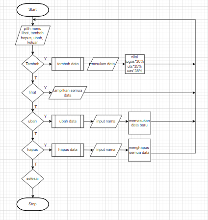
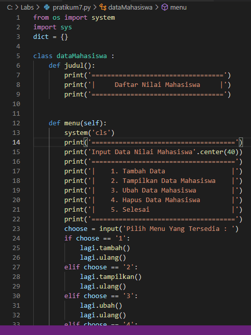
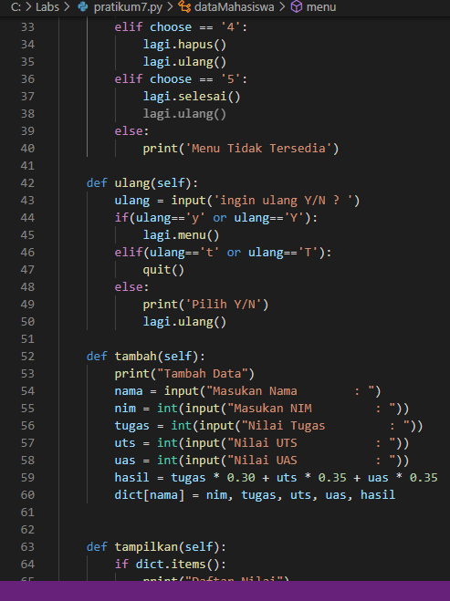
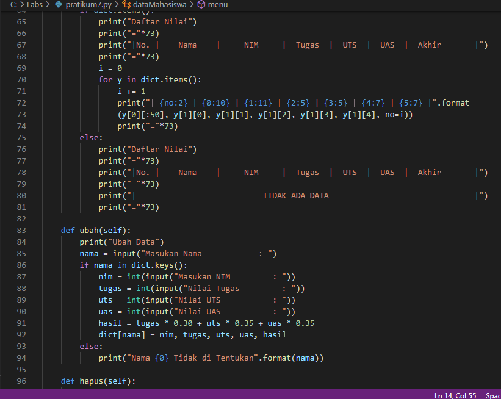
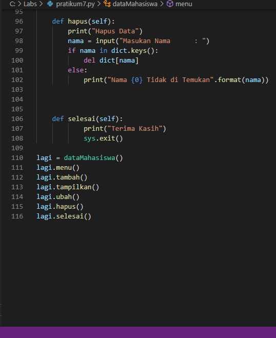
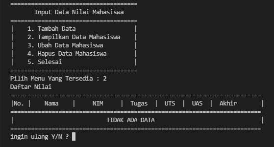
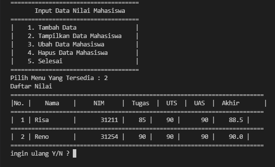
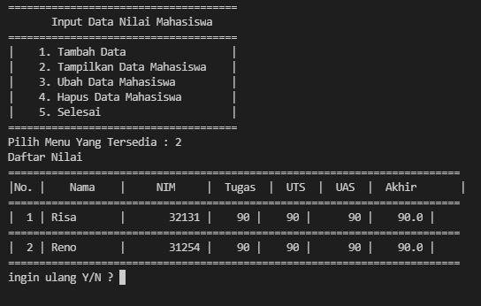
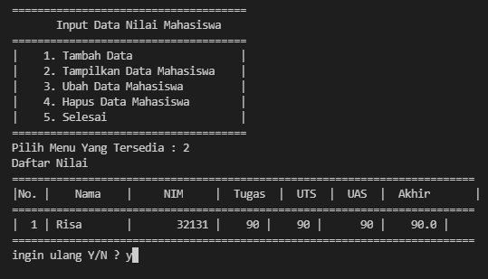
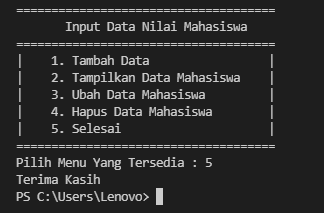

# pratikum8

## Untuk pratikum ini membuat program sederhana dengan menginput data mahasiswa menggunkan class.

1. Berikut adalah flowchart program                         

2. dict = {}, gunanya untuk menampung data mahasiswa.
3. Untuk menu pada nomer satu gunanya untuk menambah data dengan menginput nama, nim, nilai tugas, nilai uts, dan nilai uas.
4. Untuk menu pada nomer 2 gunanya untuk menampilkan data yang sudah diinput atau tersimpan.
5. Untuk menu pada nomer 3 gunanya untuk mengubah data yang sudah diinput dengan menginput data baru dengan memasukan nama.
6. Untuk menu pada nomer 4 gunanya untuk menghapus data yang ingin dihapus dengan memasukan nama.
7. Untuk menu pada nomer 5 gunanya untuk keluar dari program input data mahasiswa.
8. jika ingin mengulang atau menambah data bisa memilih Y untuk iya dan Jika tidak ingin menambah data atau mengulang kembali maka bisa memilih T untuk tidak.

### Untuk kode program bisa dilihat pada gambar dibawah ini.

### Dibawah merupakan gambar saat program dijalankan

1. Tampilan program saat dijalankan dengan perintah tampilkan tanpa tambahan data.

2. Tampilan program saat dijalankan dengan perintah menambahkan data

3. Tampilan program saat dijalankan dengan perintah ubah berdasarkan nama.

4. Tampilan program saat dijalankan dengan perintah hapus berdasarkan nama.

5. Tampilan program saat dijalankan dengan perintah keluar.             
